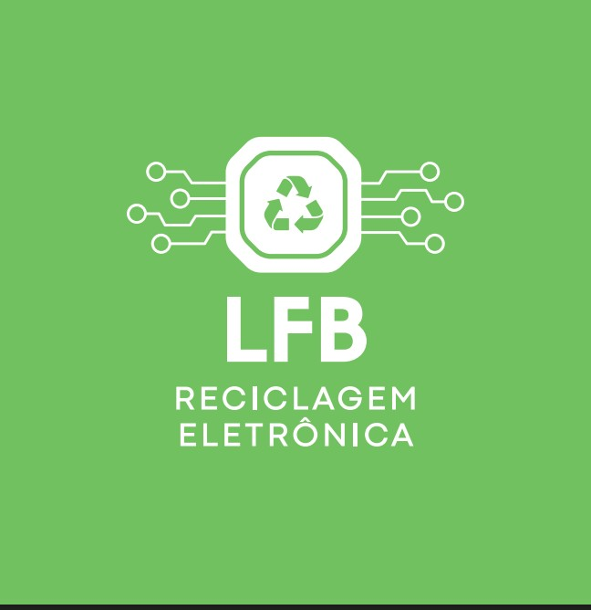

<div align="center">

<!-- Logo -->


# Controle de Materiais — LFB Reciclagem Eletrônica

**Sistema desktop para controle de pesagem e triagem de materiais recicláveis.**  
Gera recibos em PDF, gerencia tabelas de preços e importa listas de preços automaticamente.

[](https://dotnet.microsoft.com/)
[](https://avaloniaui.net/)
[]()
[]()

</div>

---

## Índice

- [Sobre o Projeto](#sobre-o-projeto)
- [Funcionalidades](#funcionalidades)
- [Screenshots](#screenshots)
- [Instalação](#instalação)
  - [Windows](#windows)
  - [Linux](#linux)
- [Como Usar](#como-usar)
  - [Registrar Pesagem](#1-registrar-pesagem)
  - [Gerenciar Tabelas de Preços](#2-gerenciar-tabelas-de-preços)
  - [Exportar Recibo PDF](#3-exportar-recibo-em-pdf)
- [Desinstalação](#desinstalação)
- [Publicar / Build](#publicar--build)
- [Tecnologias](#tecnologias)

---

## Sobre o Projeto

O **Controle de Materiais LFB** é um sistema desktop desenvolvido para a [LFB Reciclagem Eletrônica](https://github.com/lfbreciclagemeletronica) que automatiza o processo de pesagem, triagem e valoração de materiais eletrônicos recicláveis.

O sistema exibe uma lista de **52 categorias de materiais** (placas, metais, cabos, celulares, etc.), permite registrar o peso de cada item, aplica automaticamente os preços vigentes da tabela ativa e gera um **recibo oficial em PDF** pronto para entrega ao fornecedor.

---

## Funcionalidades

- **Registro de pesagem** — lista completa de 52 materiais com campos de peso (kg) e preço por kg
- **Calculo automatico** — total por item e valor geral calculados em tempo real
- **Tabelas de precos** — crie, edite, ative e delete multiplas tabelas de precos (formato JSON)
- **Importacao de PDF** — importa lista de precos diretamente de um PDF da LFB via iText7
- **Exportacao de PDF da tabela** — gera PDF formatado da lista de precos ativa
- **Recibo em PDF** — gera recibo oficial com logo, dados da empresa, fornecedor e tabela de itens
- **Persistencia automatica** — precos do mes atual sao carregados automaticamente na inicializacao
- **Interface dark moderna** — UI Avalonia com tema escuro, notificacoes toast e scroll fluido
- **Multiplataforma** — roda em Windows e Linux sem necessidade de .NET instalado

---

## Screenshots

> Adicione as imagens abaixo substituindo os comentários pelos caminhos corretos.

<div align="center">

<!-- Tela principal com lista de materiais -->
<!--  -->

**Tela Principal — Lista de Materiais**

---

<!-- Gerenciador de tabelas de preços -->
<!--  -->

**Gerenciador de Tabelas de Preços**

---

<!-- Exemplo de recibo PDF gerado -->
<!--  -->

**Exemplo de Recibo PDF Gerado**

</div>

---

## Instalação

### Windows

#### Opção A — Online (recomendado, baixa automaticamente do GitHub)

Abra o PowerShell e execute:

```powershell
powershell -ExecutionPolicy Bypass -File install-windows.ps1 -Online
```

#### Opção B — Local (após clonar o repositório e publicar)

```powershell
powershell -ExecutionPolicy Bypass -File install-windows.ps1
```

O instalador irá:
1. Verificar se já existe uma versão instalada (e oferecer substituição)
2. Verificar se o Git está instalado (e oferecer instalação automática)
3. Baixar ou copiar os arquivos para `%LOCALAPPDATA%\ControleMateriais.LFB\`
4. Criar atalho na **Área de Trabalho** (opcional)
5. Criar atalho no **Menu Iniciar** automaticamente

**Parâmetros disponíveis:**

| Parâmetro | Descrição |
|---|---|
| `-Online` | Força download da release mais recente do GitHub |
| `-InstallDir <caminho>` | Define pasta de instalação personalizada |
| `-NoShortcut` | Pula criação de atalho na Área de Trabalho |
| `-Uninstall` | Remove a instalação existente |

---

### Linux

#### Opção A — Online

```bash
chmod +x install-linux.sh && ./install-linux.sh --online
```

#### Opção B — Local (após publicar)

```bash
chmod +x install-linux.sh && ./install-linux.sh
```

O instalador irá:
1. Verificar instalação existente (e oferecer remoção)
2. Instalar Git via `apt` / `dnf` / `pacman` / `zypper` se ausente
3. Copiar arquivos para `~/.local/share/ControleMateriais.LFB/`
4. Criar symlink em `/usr/local/bin/controle-materiais-lfb` (opcional, requer `sudo`)
5. Criar atalho `.desktop` na Área de Trabalho e no menu de aplicações (opcional)

**Flags disponíveis:**

| Flag | Descrição |
|---|---|
| `--online` | Força download da release mais recente do GitHub |
| `--install-dir <caminho>` | Define pasta de instalação personalizada |
| `--no-shortcut` | Pula criação de atalho sem perguntar |
| `--uninstall` | Remove a instalação existente |

---

## Como Usar

### 1. Registrar Pesagem

<div align="center">

<!--  -->

</div>

1. Informe o **nome do fornecedor** no campo "Nome" no topo da tela
2. Clique em qualquer campo de **Peso atual (kg)** na linha do material desejado
3. Digite o peso recebido e pressione **Enter** ou clique fora do campo
4. O **Total** de cada item e o **Valor Total** geral são atualizados automaticamente
5. Itens com peso zero são omitidos do recibo PDF

---

### 2. Gerenciar Tabelas de Preços

<div align="center">

<!--  -->

</div>

Clique no botão **"Tabela de Preços"** no canto superior esquerdo da tela principal.

#### Criar nova tabela
1. Clique em **"Nova Tabela"**
2. Digite um nome para a tabela
3. Preencha os preços por kg de cada material
4. Clique em **"Salvar"**

#### Ativar uma tabela
1. Selecione a tabela desejada na lista
2. Clique em **"Ativar"** — os preços serão aplicados imediatamente na tela principal

#### Importar preços de um PDF
1. Selecione ou crie uma tabela
2. Clique em **"Importar de PDF"**
3. Selecione o arquivo PDF com a lista de preços LFB
4. O sistema extrai automaticamente os preços e preenche os campos

> **Dica:** Os arquivos de tabela ficam salvos em  
> `%USERPROFILE%\Downloads\Controle-Materiais-Registros\` (Windows)  
> `~/Downloads/Controle-Materiais-Registros/` (Linux)

---

### 3. Exportar Recibo em PDF

<div align="center">

<!--  -->

</div>

1. Certifique-se de que o **nome do fornecedor** está preenchido (campo obrigatório)
2. Registre os pesos dos materiais recebidos
3. Clique no botão **"Exportar"** no canto superior direito
4. Escolha o local e nome do arquivo PDF
5. O recibo gerado contém:
   - Cabeçalho com logo LFB, CNPJ, IE e endereço
   - Dados do fornecedor, peso total, valor total e data
   - Tabela completa de itens com KG, Preço/kg e Total

---

## Desinstalação

**Windows:**
```powershell
powershell -ExecutionPolicy Bypass -File install-windows.ps1 -Uninstall
```

**Linux:**
```bash
./install-linux.sh --uninstall
```

---

## Publicar / Build

Para gerar os binários de distribuição (requer .NET SDK instalado):

```powershell
# Publica Windows x64 + Linux x64 e empacota em .zip
.\publish.ps1

# Apenas Windows
.\publish.ps1 -Target win

# Apenas Linux
.\publish.ps1 -Target linux

# Sem empacotar em ZIP
.\publish.ps1 -SkipZip
```

Os arquivos são gerados em:
```
release/
  win-x64/                            <- binários Windows
  linux-x64/                          <- binários Linux
  ControleMateriais-win-x64.zip       <- para upload no GitHub Releases
  ControleMateriais-linux-x64.zip     <- para upload no GitHub Releases
```

---

## Tecnologias

| Tecnologia | Versão | Uso |
|---|---|---|
| [.NET](https://dotnet.microsoft.com/) | 10 | Runtime e SDK |
| [Avalonia UI](https://avaloniaui.net/) | 11 | Framework de UI multiplataforma |
| [QuestPDF](https://www.questpdf.com/) | latest | Geração de recibos e listas em PDF |
| [iText7](https://itextpdf.com/) | latest | Extração de texto de PDFs |
| MVVM | — | Arquitetura (ViewModels + Commands) |

---

<div align="center">

Desenvolvido para **LFB Reciclagem Eletrônica**  
CNPJ: 24.325.067/0001-64 · Rua Sergio Jungblut Dieterich, 1011 - Letra B, Galpão 5

</div>
