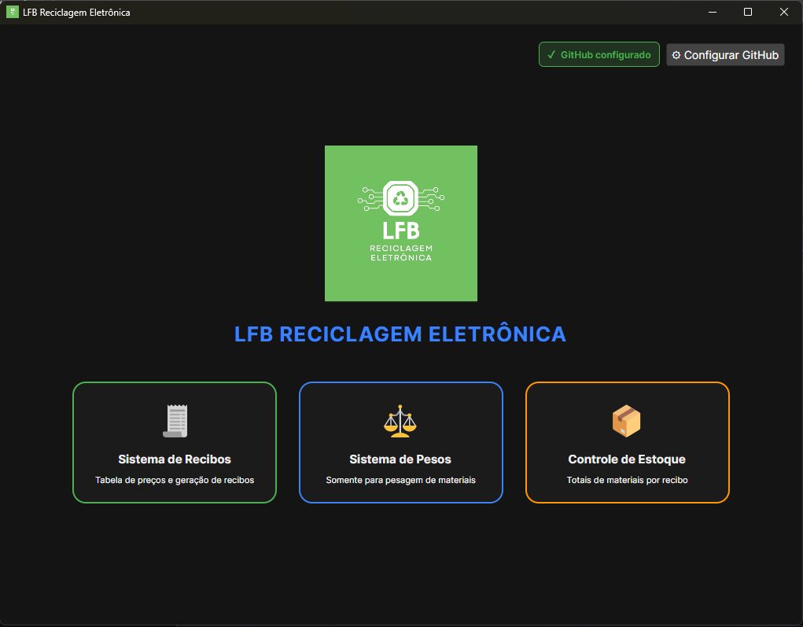
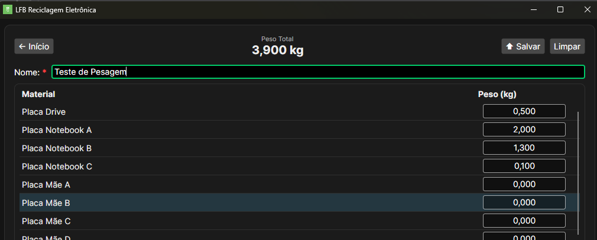
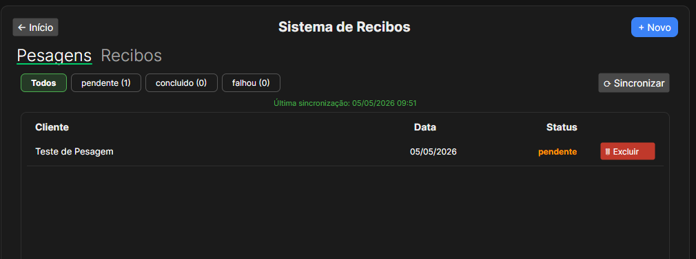
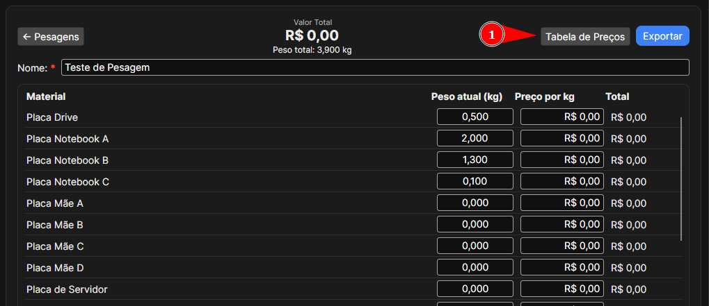
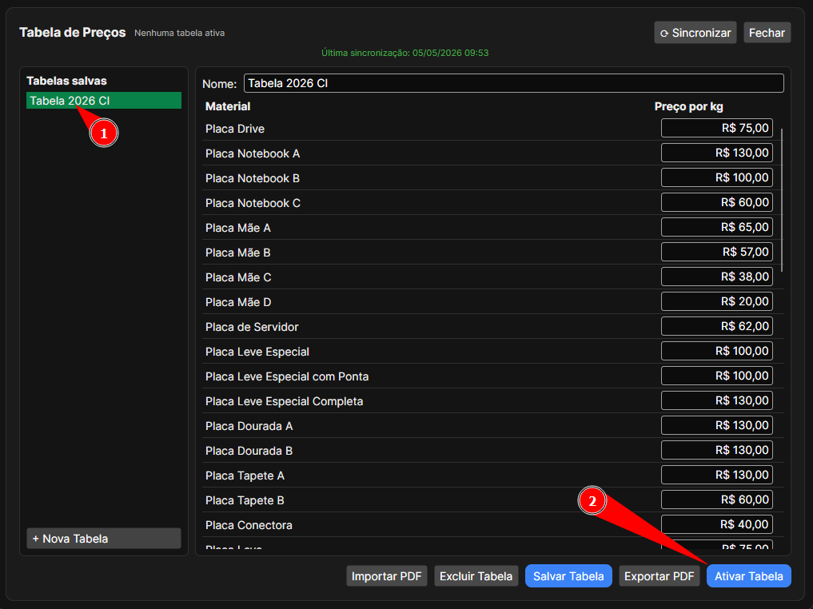
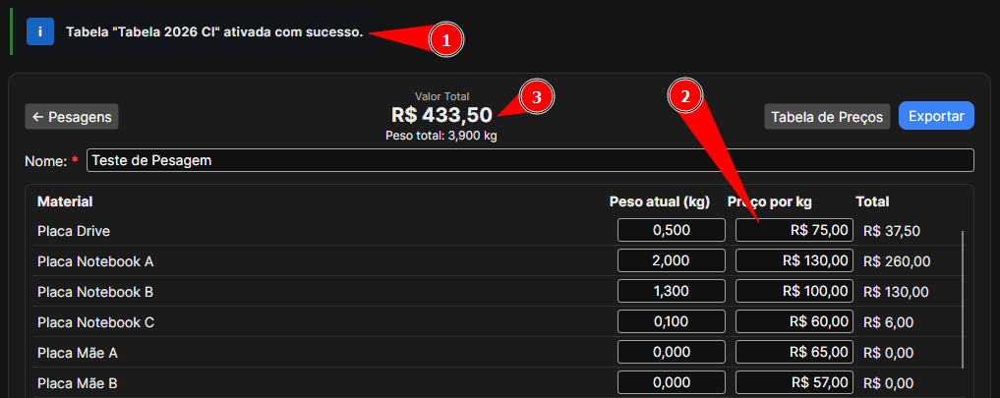

<div align="center">

<!-- Logo -->


# LFB Controle de Materiais — LFB Reciclagem Eletrônica

**Sistema desktop completo para controle de pesagem, triagem, valoração e venda de materiais eletrônicos recicláveis.**  
Registra pesagens, gera recibos em PDF, gerencia tabelas de preços, controla o estoque por material e registra vendas com recibo dedicado — tudo sincronizado automaticamente com o GitHub.

> **Versão atual: V5.0.1**

[](https://dotnet.microsoft.com/)
[](https://avaloniaui.net/)
[]()
[]()

</div>

---

## Índice

- [Sobre o Projeto](#sobre-o-projeto)
- [Visão Geral da Arquitetura](#visão-geral-da-arquitetura)
- [Configuração Inicial — GitHub](#configuração-inicial--github)
- [Sistema de Pesos (Calculadora)](#sistema-de-pesos-calculadora)
  - [Como funciona](#como-funciona-a-calculadora)
  - [Itens personalizados e Impurezas](#itens-personalizados-e-impurezas)
  - [Tabelas de Preços](#tabelas-de-preços)
  - [Sincronização de Tabelas com o GitHub](#sincronização-de-tabelas-com-o-github)
- [Sistema de Pesagens](#sistema-de-pesagens)
  - [O que é uma Pesagem](#o-que-é-uma-pesagem)
  - [Aba Pesagens — Filtros e Lista](#aba-pesagens--filtros-e-lista)
  - [Sincronização de Pesagens com o GitHub](#sincronização-de-pesagens-com-o-github)
  - [Fluxo completo de uma Pesagem](#fluxo-completo-de-uma-pesagem)
- [Sistema de Recibos](#sistema-de-recibos)
  - [Gerar Recibo a partir de uma Pesagem](#gerar-recibo-a-partir-de-uma-pesagem)
  - [Gerar Recibo manualmente](#gerar-recibo-manualmente)
  - [Aba Recibos — Visualização de PDFs](#aba-recibos--visualização-de-pdfs)
  - [Sincronização de Recibos com o GitHub](#sincronização-de-recibos-com-o-github)
- [Estrutura de Diretórios Locais](#estrutura-de-diretórios-locais)
- [Estrutura de Repositórios no GitHub](#estrutura-de-repositórios-no-github)
- [Sistema de Controle de Estoque](#sistema-de-controle-de-estoque)
- [Sistema de Venda de Estoque](#sistema-de-venda-de-estoque)
  - [Registrar uma venda](#registrar-uma-venda)
  - [Recibo de Venda PDF](#recibo-de-venda-pdf)
  - [Aba Recibos de Venda](#aba-recibos-de-venda)
- [Exportar Excel](#exportar-excel)
- [Reconstruir Banco de Dados](#reconstruir-banco-de-dados)
- [Publicar / Build](#publicar--build)
- [Tecnologias](#tecnologias)

---

## Sobre o Projeto

O **Controle de Materiais LFB** é um sistema desktop desenvolvido para a [LFB Reciclagem Eletrônica](https://github.com/lfbreciclagemeletronica) que automatiza o processo de pesagem, triagem e valoração de materiais eletrônicos recicláveis.

O sistema é composto por sete módulos integrados:

- **Calculadora de Pesos** — registra os materiais e pesos recebidos de um fornecedor, calcula o valor total usando a tabela de preços ativa e gera o recibo em PDF
- **Sistema de Pesagens** — gerencia todas as pesagens geradas pelo aplicativo de balanças externo, exibindo status (pendente, concluído, falhou) e sincronizando com o GitHub
- **Sistema de Recibos** — armazena e exibe todos os PDFs de recibos gerados, sincronizando com repositório GitHub dedicado
- **Controle de Estoque** — consolida todas as pesagens do banco de dados em um estoque unificado por material, com sincronização Git
- **Venda de Estoque** — registra saídas de estoque por venda, gera recibo PDF dedicado e atualiza o `estoque.json` automaticamente
- **Exportar Excel** — gera planilha `.xlsx` com pesagens e vendas por dia e coluna de Estoque Atual calculada
- **Reconstruir Banco** — reconstrói todo o `banco-de-dados/` a partir dos PDFs existentes, reprocessando pesagens e descontando vendas

Toda a sincronização é feita via **Git** usando repositórios privados no GitHub da organização `lfbreciclagemeletronica`, sem necessidade de nenhuma outra infraestrutura.

---

## Visão Geral da Arquitetura

```
~/Downloads/ControleMateriaisLFB/
├── credenciais.json              ← Token GitHub, usuário e e-mail git
├── Pesagens/                     ← Repositório git clonado (lfbreciclagemeletronica/Pesagens)
│   ├── .git/
│   ├── Cliente_24-04-2026.json           ← pesagem pendente
│   └── Cliente_24-04-2026_concluido.json ← pesagem concluída (renomeada automaticamente)
├── banco-de-dados/               ← Repositório git clonado (lfbreciclagemeletronica/banco-de-dados)
│   ├── .git/
│   ├── estoque.json
│   └── <NomeCliente>_<data>.json  ← JSON por pesagem concluída
├── reconstruir-banco.log         ← Log gerado pelo Reconstruir Banco (diagnóstico)
├── Recibos/
│   ├── .git/
│   ├── *.pdf
│   └── Recibos_Venda/
│       ├── Cliente_05-05-2026.pdf
│       └── Cliente_05-05-2026.pdf.meta.json
└── TabelaPrecos/                 ← Repositório git clonado (lfbreciclagemeletronica/TabelaPrecos)
    ├── .git/
    └── Tabela2026CI.json
```

Cada módulo possui seu próprio repositório Git remoto. O sistema realiza `clone`, `fetch`, `rebase` e `push` automaticamente conforme o usuário usa o programa.

---

## Configuração Inicial — GitHub

Antes de usar qualquer funcionalidade de sincronização, é necessário configurar as credenciais do GitHub na **tela inicial (Home)**.

<div align="center">

<!-- Coloque aqui uma imagem da tela de configuração do GitHub -->


</div>

**Dados necessários:**
- **Token GitHub** — Personal Access Token com permissões de `repo` (leitura e escrita)
- **Usuário GitHub** — nome de usuário (usado como autor dos commits)
- **E-mail Git** — e-mail associado à conta GitHub (usado nos commits)

As credenciais são salvas em `~/Downloads/ControleMateriaisLFB/credenciais.json` localmente. O token é embutido na URL remota do Git no formato `https://<token>@github.com/...` em cada operação, nunca armazenado no repositório.

> **Sem credenciais configuradas**, os botões de sincronização e exportação para o GitHub ficam desabilitados, mas o sistema continua funcionando localmente.

---

## Sistema de Pesos (Pesagem)

### Como funciona a Pesagem

A tela exibe a lista completa de **52 categorias de materiais** (placas, metais, cabos, celulares, etc.) onde a pessoa coloca a quantidade de cada material que foi pesada.

<div align="center">

<!-- Coloque aqui uma imagem da tela principal da calculadora -->


</div>

**Fluxo de uso:**

1. Informe o **nome do fornecedor** no campo "Nome" no topo da tela
2. Clique em qualquer campo de **Peso atual (kg)** na linha do material desejado
3. Digite o peso recebido e pressione **Enter** ou clique fora do campo para confirmar
4. Pressione **Esc** para cancelar e restaurar o valor anterior sem salvar
5. Clique em qualquer parte de uma linha para **selecioná-la** com destaque visual azul
6. Após preencher todos os pesos, clique no botão **"Salvar Pesagem"** para salvar a pesagem
7. Após Salvar ele vai enviar para o repositório do Github de pesagens e manter no local também

<div align="center">

<!-- Coloque aqui uma imagem com pesos preenchidos e totais calculados -->


</div>

---

## Sistema de Recibos

### Abas de pesagens feitas

A tela exibe a lista completa de **pesagens feitas** onde a pessoa pode ver todas as pesagens que foram salvas.

<div align="center">

<!-- Coloque aqui uma imagem da tela de pesagens feitas -->


</div>

> Quando aparece o status de **pendente** significa que a pesagem ainda não foi criada um recibo dela, clique no nome do cliente para começar o processo de criação de recibo dessa pesagem.

---

### Criando um recibo

Após clicar no nome do cliente, você será direcionado para a tela de criação de recibo.

Os pesos dos itens pesados serão automaticamente preenchidos na tela de criação de recibo.

Selecione a **Tabela de Preços** que será utilizada para calcular o valor do recibo.

<div align="center">

<!-- Coloque aqui uma imagem da tela de criação de recibo -->


</div>

Depois, selecione qual a tabela de preços ou crie uma nova, depois clique em **Ativar Tabela**

<div align="center">

<!-- Coloque aqui uma imagem da tela de criação de recibo -->


</div>

O sistema vai pegar os valores da tabela de preços e os pesos e vai calcular automaticamente todos os valores do recibo. Para finalizar clique em **Exportar**.

<div align="center">

<!-- Coloque aqui uma imagem da tela de exportação de recibo -->


</div>

---

### Itens Personalizados e Impurezas

Abaixo da lista principal existem recursos adicionais para casos especiais:

- **4 Itens Personalizados** — linhas livres com nome editável. Preencha o nome do material, o peso (kg) e o preço por kg. Itens com nome e peso preenchidos aparecem no recibo PDF com os mesmos campos dos itens padrão.
- **Campo Impurezas** — campo de peso exclusivo. O peso de impurezas é somado ao **Peso Total** e incluído no final do recibo, mas **não entra no cálculo do valor monetário**.

---

### Tabelas de Preços

As tabelas de preços definem o valor por kg de cada material. O sistema suporta múltiplas tabelas simultâneas — apenas uma fica **ativa** por vez e seus preços são aplicados automaticamente na calculadora.

Acesse clicando em **"Tabela de Preços"** na tela principal.

<div align="center">

<!-- Coloque aqui uma imagem da tela de tabelas de preços -->


</div>

---

#### Criar nova tabela

1. Clique em **"+ Nova Tabela"** na lista à esquerda
2. Digite o nome da tabela no campo superior (ex: `Tabela 2026 CI`)
3. Preencha os preços por kg de cada material no editor à direita
4. Clique em **"Salvar Como Nova"** — a tabela é salva como JSON em `TabelaPrecos/` e enviada ao GitHub automaticamente

<div align="center">

<!-- Coloque aqui uma imagem do formulário de nova tabela -->

</div>

#### Selecionar e editar uma tabela existente

1. Clique sobre o nome da tabela na lista à esquerda para selecioná-la
2. O editor de preços é exibido à direita com os valores atuais
3. Edite os preços desejados diretamente nos campos
4. Clique em **"Salvar Tabela"** — o JSON é atualizado localmente e o commit é enviado ao GitHub automaticamente

<div align="center">

<!-- Coloque aqui uma imagem da edição de uma tabela existente -->

</div>

#### Ativar uma tabela

1. Selecione a tabela desejada na lista
2. Clique em **"Ativar Tabela"** — os preços são aplicados imediatamente na calculadora
3. A tabela ativa fica marcada com o badge **ATIVA** na lista e o label no topo da tela exibe o nome dela

<div align="center">

<!-- Coloque aqui uma imagem com o badge ATIVA e o label no topo -->

</div>

#### Importar preços de um PDF

1. Selecione ou crie uma tabela
2. Clique em **"Importar PDF"**
3. Selecione o arquivo PDF com a lista de preços LFB
4. O sistema extrai automaticamente os preços usando o iText7 e preenche todos os campos reconhecidos

#### Exportar tabela em PDF

1. Selecione a tabela desejada
2. Clique em **"Exportar PDF"**
3. O PDF da lista de preços é gerado com logo LFB, nome da tabela e todos os materiais com preços

<div align="center">

<!-- Coloque aqui uma imagem do PDF de lista de preços gerado -->

</div>

#### Excluir uma tabela

1. Selecione a tabela na lista
2. Clique em **"Excluir Tabela"**
3. O arquivo JSON é removido localmente, o `git rm` é executado e a remoção é commitada e enviada ao GitHub automaticamente

---

### Sincronização de Tabelas com o GitHub

O repositório `lfbreciclagemeletronica/TabelaPrecos` armazena todos os arquivos JSON de tabelas de preços.

**Fluxo na primeira abertura (sem repo local):**

```
1. Sistema detecta que ~/Downloads/ControleMateriaisLFB/TabelaPrecos/ não tem .git
2. Se existirem JSONs legados na pasta (criados antes da sincronização), eles são preservados
3. git clone https://<token>@github.com/lfbreciclagemeletronica/TabelaPrecos → pasta temp
4. JSONs legados são copiados para o repo clonado + git add + git commit + git push
5. Pasta temp é movida para TabelaPrecos/ (substituindo a legada)
6. Lista de tabelas é recarregada do repositório clonado
```

**Fluxo em aberturas seguintes (repo já clonado):**

```
1. git fetch origin main
2. git rebase origin/main  ← mantém histórico linear
3. Lista recarregada com as tabelas do remoto (incluindo as adicionadas por outros dispositivos)
```

**Sincronização automática ao salvar ou criar:**

```
1. JSON é salvo localmente em TabelaPrecos/<nome>.json
2. git add <arquivo>
3. git commit -m "Nova tabela: <nome>" ou "Atualizar tabela: <nome>"
4. git push origin main
```

**Sincronização automática ao excluir:**

```
1. Arquivo é deletado do disco
2. git rm <arquivo>
3. git commit -m "Excluir tabela <nome>"
4. git push origin main
```

O botão **⟳ Sincronizar** na tela de Tabelas de Preços força um pull completo + push de qualquer JSON local ainda não commitado.

<div align="center">

<!-- Coloque aqui uma imagem do status de sincronização na tela de tabelas -->

</div>

---

## Sistema de Pesagens

### O que é uma Pesagem

Uma **pesagem** é um arquivo JSON gerado pelo **aplicativo de balanças externo** (tablet ou computador da balança) e publicado no repositório `lfbreciclagemeletronica/Pesagens` no GitHub. Cada arquivo representa o registro de uma coleta de materiais de um fornecedor.

**Estrutura do arquivo JSON de pesagem:**

```json
{
  "Cliente": "Gabriel Fanto Stundner",
  "DataHora": "2026-04-24T10:30:00",
  "StatusPesagem": "pendente",
  "Itens": [
    { "Nome": "Placa Drive", "Peso": 2.500 },
    { "Nome": "Placa Notebook A", "Peso": 1.200 }
  ]
}
```

O campo `StatusPesagem` pode ser:
- **`pendente`** — pesagem registrada, aguardando geração do recibo
- **`concluido`** — recibo gerado e pesagem finalizada
- **`falhou`** — erro no processo da pesagem

---

### Aba Pesagens — Filtros e Lista

A aba **Pesagens** exibe todas as pesagens sincronizadas do repositório remoto. A lista é **deduplicada por cliente** — para cada fornecedor, apenas a pesagem mais recente é exibida.

<div align="center">

<!-- Coloque aqui uma imagem da aba Pesagens com a lista e os filtros -->

</div>

**Filtros disponíveis:**

| Filtro | Descrição |
|---|---|
| **Todos** | Exibe todas as pesagens (sem contagem ao lado) |
| **pendente (N)** | Exibe somente pesagens aguardando recibo, com contagem total |
| **concluido (N)** | Exibe somente pesagens com recibo gerado, com contagem total |
| **falhou (N)** | Exibe somente pesagens com erro, com contagem total |

As contagens são calculadas sobre o **total de pesagens no repositório** (antes da deduplicação por cliente), garantindo que o número reflita a realidade do banco de dados.

Ao clicar em uma pesagem **pendente**, o sistema abre automaticamente a tela de criação de recibo com os dados da pesagem pré-preenchidos (cliente, materiais e pesos).

---

### Sincronização de Pesagens com o GitHub

A sincronização é disparada **automaticamente toda vez que o usuário clica na aba Pesagens**, sem limite de frequência.

**Fluxo de sincronização:**

```
1. Verifica credenciais GitHub — se não configuradas, exibe aviso e para
2. Verifica se Git está instalado — instala via winget se necessário
3. Se TabelaPrecos/Pesagens/.git não existe → git clone do repositório remoto
4. Se já existe → git fetch origin main + git rebase origin/main
5. Configura identidade git (user.name e user.email)
6. Varre todos os JSONs da pasta que NÃO têm _concluido no nome
7. Para cada JSON com StatusPesagem = "concluido":
   a. Lê o nome do cliente do JSON
   b. git mv <arquivo>.json <arquivo>_concluido.json
   c. git add <arquivo>_concluido.json
   d. git commit -m "<Nome do Cliente> - pesagem concluída"
8. git push origin main (único push ao final, após todos os commits individuais)
9. Recarrega a lista de pesagens da pasta local
```

> Cada pesagem concluída gera **um commit individual** com o nome do cliente na mensagem, tornando o histórico do GitHub completamente rastreável.

<div align="center">

<!-- Coloque aqui uma imagem do histórico de commits no GitHub com os nomes dos clientes -->

</div>

**Status em tempo real** — durante a sincronização, mensagens de progresso são exibidas na interface:
- `Verificando Git...`
- `Atualizando repositório (pull)...`
- `Commitando: <arquivo>...`
- `Enviando alterações ao GitHub...`

---

### Fluxo completo de uma Pesagem

```
[Balança/Tablet]                    [Controle Materiais LFB]
      │                                        │
      │  gera arquivo JSON                     │
      │  StatusPesagem: "pendente"              │
      │                                        │
      ▼                                        │
[GitHub: Pesagens repo]                        │
      │                                        │
      │  ◄──── git fetch + rebase ─────────────┤ (ao abrir aba Pesagens)
      │                                        │
      │                           exibe na lista como "pendente"
      │                                        │
      │                           usuário clica na pesagem
      │                                        │
      │                           tela de recibo abre pré-preenchida
      │                                        │
      │                           usuário clica "Exportar"
      │                                        │
      │                           PDF gerado + StatusPesagem → "concluido"
      │                                        │
      │  ◄──── git commit + push ──────────────┤ "Atualizar: <cliente> concluido"
      │                                        │
      │  ◄──── git mv + commit + push ─────────┤ "<cliente> - pesagem concluída"
      │                                        │
[Arquivo renomeado: _concluido.json]           │
```

---

## Sistema de Recibos

### Gerar Recibo a partir de uma Pesagem

O caminho mais comum: o usuário seleciona uma pesagem **pendente** na aba Pesagens e o sistema abre a tela de recibo com todos os dados pré-preenchidos.

<div align="center">

<!-- Coloque aqui uma imagem da tela de recibo com dados pré-preenchidos da pesagem -->

</div>

**O que é pré-preenchido automaticamente:**
- Nome do cliente/fornecedor
- Lista de materiais e pesos da pesagem
- Cálculo automático dos valores usando a tabela de preços ativa

**Ao clicar em "Exportar":**

1. O sistema valida que o nome do fornecedor está preenchido
2. Garante que o repositório `Recibos` está clonado localmente (`GarantirRecibosRepoAsync`)
3. Abre o seletor de arquivo já apontando para a pasta `Recibos/` local
4. O nome sugerido do arquivo segue o padrão: `<NomeCliente>_<dd-MM-yyyy>.pdf`
5. O PDF é gerado com QuestPDF contendo:
   - Cabeçalho com logo LFB, CNPJ (`24.325.067/0001-64`), IE e endereço
   - Nome do fornecedor, data, peso total e valor total
   - Tabela de itens com: Material | Peso (kg) | Preço/kg | Total (R$)
   - Campo de impurezas (se houver) ao final da tabela
6. A pesagem de origem é **marcada como concluída** no arquivo JSON local
7. O PDF é publicado no repositório `Recibos` no GitHub (`PublicarReciboAsync`)
8. O JSON da pesagem atualizado é commitado no repositório `Pesagens`

<div align="center">

<!-- Coloque aqui uma imagem do PDF de recibo gerado -->

</div>

---

### Gerar Recibo manualmente

Também é possível gerar um recibo diretamente da tela principal (calculadora), sem partir de uma pesagem:

1. Preencha o **nome do fornecedor**
2. Registre os pesos dos materiais desejados
3. Clique em **"Exportar"** no canto superior direito
4. O fluxo de geração e sincronização é idêntico ao da pesagem, exceto que nenhum arquivo JSON de pesagem é atualizado

---

### Aba Recibos — Visualização de PDFs

A segunda aba da tela de Pesagens exibe todos os recibos PDF salvos no repositório local `Recibos/`.

<div align="center">

<!-- Coloque aqui uma imagem da aba Recibos com a lista de PDFs -->

</div>

**Funcionalidades:**
- Lista todos os PDFs com nome e data de criação
- Ordenados do mais recente para o mais antigo
- Botão **"Abrir"** ao lado de cada recibo — abre o PDF no visualizador padrão do sistema operacional
- Sincronização automática ao clicar na aba (pull do repositório remoto)

---

### Sincronização de Recibos com o GitHub

O repositório `lfbreciclagemeletronica/Recibos` armazena todos os PDFs de recibos gerados.

**Fluxo na primeira exportação (sem repo local):**

```
1. Sistema detecta que ~/Downloads/ControleMateriaisLFB/Recibos/ não tem .git
2. Se existirem PDFs legados na pasta, eles são preservados
3. git clone https://<token>@github.com/lfbreciclagemeletronica/Recibos → pasta temp
4. PDFs legados são copiados para o repo clonado + git add + git commit + git push
5. Pasta temp é movida para Recibos/ (substituindo a legada)
```

**Fluxo ao abrir a aba Recibos (repo já clonado):**

```
1. git fetch origin main
2. git rebase origin/main
3. Lista de PDFs recarregada da pasta local (inclui recibos gerados em outros dispositivos)
```

**Fluxo ao publicar um novo recibo:**

```
1. PDF gerado localmente em Recibos/<NomeCliente>_<data>.pdf
2. git remote set-url origin <url com token>
3. git config user.name / user.email
4. git add <arquivo.pdf>
5. git commit -m "Recibo <NomeCliente> - <dd/MM/yyyy>"
6. git push origin main
```

<div align="center">

<!-- Coloque aqui uma imagem do repositório Recibos no GitHub com os PDFs -->

</div>

> **Disponibilidade entre dispositivos** — qualquer recibo gerado em um computador fica disponível automaticamente em todos os outros ao abrir a aba Recibos, pois o pull é feito automaticamente a cada troca de aba.

---

## Estrutura de Diretórios Locais

```
~/Downloads/ControleMateriaisLFB/
│
├── credenciais.json
│     Token GitHub, usuário e e-mail git
│
├── Pesagens/                         (repositório git)
│   ├── .git/
│   ├── Joao_Silva_23-04-2026.json           ← pendente
│   ├── Maria_Oliveira_23-04-2026_concluido.json  ← concluído
│   └── ...
│
├── Recibos/                          (repositório git)
│   ├── .git/
│   ├── Joao_Silva_23-04-2026.pdf
│   ├── Maria_Oliveira_22-04-2026.pdf
│   └── ...
│
└── TabelaPrecos/                     (repositório git)
    ├── .git/
    ├── Tabela2026CI.json
    ├── Tabela2026Gold.json
    └── ...
```

---

## Estrutura de Repositórios no GitHub

| Repositório | URL | Conteúdo |
|---|---|---|
| `Pesagens` | `github.com/lfbreciclagemeletronica/Pesagens` | JSONs de pesagens (pendentes e concluídas) |
| `Recibos` | `github.com/lfbreciclagemeletronica/Recibos` | PDFs de pesagem + subpasta `Recibos_Venda/` |
| `TabelaPrecos` | `github.com/lfbreciclagemeletronica/TabelaPrecos` | JSONs de tabelas de preços |
| `banco-de-dados` | `github.com/lfbreciclagemeletronica/banco-de-dados` | JSONs por pesagem + `estoque.json` consolidado |

**Padrão de mensagens de commit:**

| Operação | Mensagem |
|---|---|
| Pesagem concluída | `<Nome do Cliente> - pesagem concluída` |
| Novo recibo | `Recibo <NomeCliente> - <dd/MM/yyyy>` |
| Nova tabela | `Nova tabela: <nome>` |
| Tabela atualizada | `Atualizar tabela: <nome>` |
| Tabela excluída | `Excluir tabela <nome.json>` |
| Migração de arquivos legados | `Migração de tabelas de preços existentes` |
| Sync geral | `Sincronização de tabelas de preços` |

---

## Sistema de Controle de Estoque

A tela **Controle de Estoque** é acessível pelo botão **📦 Estoque** na tela inicial. Ela consolida todas as pesagens registradas em `banco-de-dados/` e calcula o saldo atual de cada material.

<div align="center">

<!-- Imagem da tela Controle de Estoque — aba Estoque -->

</div>

**Funcionalidades:**
- Lista todos os materiais do catálogo com o total em kg acumulado.
- Botão **⟳ Sincronizar** — pull do repositório `banco-de-dados` e push do `estoque.json` atualizado. Também sincroniza `Recibos/Recibos_Venda/` antes de recarregar.
- Botão **💰 Venda** — abre o módulo de venda de estoque.
- **Aba Recibos de Venda** — lista todos os recibos de venda gerados.
- Botão **⟳ Atualizar** (aba Recibos de Venda) — pull de `Recibos_Venda/` do GitHub antes de recarregar a lista.

---

## Sistema de Venda de Estoque

### Registrar uma venda

Acesse pelo botão **💰 Venda** na tela de Controle de Estoque.

<div align="center">

<!-- Imagem da tela de Nova Venda de Estoque -->

</div>

**Fluxo de uso:**

1. Preencha o **Nome do Cliente** (obrigatório).
2. Preencha o **Valor da Venda (R$)** — campo formata automaticamente como `R$ X.XXX,XX` ao confirmar.
3. Informe o **peso em kg** de cada material vendido — funciona igual ao sistema de pesagens.
4. O **Peso Total** é atualizado automaticamente em tempo real.
5. Clique em **💾 Salvar Venda**.

**O que acontece ao salvar:**

1. PDF do recibo gerado em `Recibos/Recibos_Venda/`.
2. Arquivo `.pdf.meta.json` salvo ao lado com cliente, peso, valor e data.
3. Itens vendidos subtraídos do `estoque.json` local (nunca fica negativo).
4. Modal de sucesso exibido com botão **📄 Abrir PDF**.
5. PDF publicado no GitHub (`Recibos/Recibos_Venda/`).
6. `estoque.json` atualizado publicado no GitHub (`banco-de-dados/`).

---

### Recibo de Venda PDF

Gerado com QuestPDF com layout profissional:

<div align="center">

<!-- Imagem do recibo de venda PDF gerado -->

</div>

- Cabeçalho LFB idêntico ao recibo de pesagem (logo, CNPJ, IE, endereço).
- Faixa de informações: **CLIENTE** | **PESO** | **VALOR** | **DATA**.
- Título: `RECIBO DE VENDA DE ESTOQUE`.
- Tabela de itens com apenas **MATERIAL** e **KG** (sem preço/kg).
- Nome do arquivo: `{NomeCliente}_{dd-MM-yyyy}.pdf`.

---

### Aba Recibos de Venda

Segunda aba do Controle de Estoque exibe todos os recibos de venda gerados.

<div align="center">

<!-- Imagem da aba Recibos de Venda -->

</div>

**Filtros:**
- Campo de texto — filtra por nome do cliente em tempo real.
- Campo de Mês/Ano (ex: `05/2026`) — filtra pelos recibos do mês.
- Botão **⟳ Atualizar** — recarrega a lista do diretório local.

**Por linha:**
- **Peso Total** — em laranja.
- **Valor Total** — em verde (vazio para recibos antigos sem `.meta.json`).
- **Data** — em texto principal (visível no tema escuro).
- Botão **📄 Abrir** — abre o PDF no visualizador padrão.
- Botão **🗑 Excluir** (vermelho) — remove PDF e `.meta.json` com confirmação.

---

## Exportar Excel

Acessível pelo botão **📊 Exportar Excel** na aba de Recibos (tela de Pesagens).

<div align="center">

<!-- Imagem do botão Exportar Excel na aba de Recibos -->

</div>

**O que é gerado:**

| Bloco | Cor | Conteúdo |
|-------|-----|----------|
| **Pesagens por dia** | Verde | Uma coluna por data + coluna **TOTAL** |
| **Vendas por dia** | Laranja | Uma coluna por data de venda + coluna **TOTAL VENDAS** |
| **Estoque Atual** | Azul | `TOTAL pesagem − TOTAL VENDAS` por item |

<div align="center">

<!-- Imagem da planilha Excel gerada com os três blocos de colunas -->

</div>

**Detalhes:**
- Lê todos os PDFs de pesagem em `Recibos/` (raiz).
- Lê todos os PDFs de venda em `Recibos/Recibos_Venda/`.
- Extrai pesos por item via `ReciboParserService` (iText7).
- Linha de totais ao final em cada bloco.
- Itens fora do catálogo exibidos em seção separada com linha divisória roxa.
- Cabeçalho e coluna de nomes congelados.
- Compatível com zero vendas: blocos laranja e azul omitidos automaticamente.

---

## Reconstruir Banco de Dados

Acessível pelo botão **🔄 Reconstruir Banco** na aba de Recibos (tela de Pesagens).

<div align="center">

<!-- Imagem do botão Reconstruir Banco na aba de Recibos -->

</div>

> ⚠️ **Ação destrutiva** — apaga todos os JSONs em `banco-de-dados/` e recalcula do zero a partir dos PDFs.

**Fluxo:**

```
1. Sincroniza Recibos/Recibos_Venda/ com o GitHub (pull)
2. Apaga todos os .json em banco-de-dados/ (exceto .git/)
3. Para cada PDF em Recibos/*.pdf (excluindo PDFs que também existem em Recibos_Venda/):
   → extrai pesos via ReciboParserService
   → grava <nome>.json em banco-de-dados/
   → acumula em totaisPesagem
4. Para cada PDF em Recibos/Recibos_Venda/*.pdf:
   → subtrai pesos do totaisEstoque
5. Grava estoque.json com o saldo final
6. Atualiza a tela de Estoque automaticamente
7. Grava log de diagnóstico em reconstruir-banco.log
```

**Após a reconstrução**, a tela de Controle de Estoque é atualizada automaticamente sem precisar navegar de volta.

---

## Publicar / Build

Para gerar os binários de distribuição (requer .NET SDK instalado):

```powershell
# Publica Windows x64 + Linux x64 (ambos)
.\publish.ps1

# Apenas Windows x64
.\publish.ps1 -Target win

# Apenas Linux x64
.\publish.ps1 -Target linux

# Pasta de saída personalizada
.\publish.ps1 -OutDir minha-pasta
```

Os arquivos são gerados em:
```
release/
  win-x64/
    ControleMateriais.Desktop.exe     ← executável portátil Windows
  linux-x64/
    ControleMateriais.Desktop         ← executável portátil Linux
```

Os executáveis são **self-contained** — não requerem .NET instalado nem permissão de administrador.

```powershell
# Gerar/atualizar ícone do app a partir do logo (Assets/lfb-logo.png)
powershell -ExecutionPolicy Bypass -File generate-icon.ps1
```

---

## Tecnologias

| Tecnologia | Versão | Uso |
|---|---|---|
| [.NET](https://dotnet.microsoft.com/) | 10 | Runtime e SDK |
| [Avalonia UI](https://avaloniaui.net/) | 11 | Framework de UI multiplataforma (MVVM) |
| [QuestPDF](https://www.questpdf.com/) | latest | Geração de recibos e listas em PDF |
| [iText7](https://itextpdf.com/) | latest | Extração de texto de PDFs importados |
| [ClosedXML](https://github.com/ClosedXML/ClosedXML) | latest | Geração de planilhas `.xlsx` |
| Git | — | Controle de versão e sincronização com GitHub |

---

<div align="center">

Desenvolvido para **LFB Reciclagem Eletrônica**  
CNPJ: 24.325.067/0001-64 · Rua Sergio Jungblut Dieterich, 1011 - Letra B, Galpão 5

</div>
