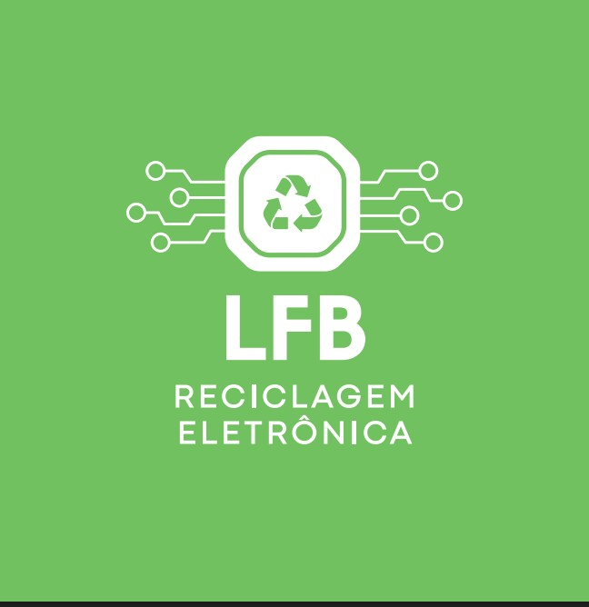

<div align="center">

<!-- Logo -->


# Controle de Materiais — LFB Reciclagem Eletrônica

**Sistema desktop para controle de pesagem e triagem de materiais recicláveis.**  
Gera recibos em PDF, gerencia tabelas de preços e importa listas de preços automaticamente.

[](https://dotnet.microsoft.com/)
[](https://avaloniaui.net/)
[]()
[]()

</div>

---

## Índice

- [Sobre o Projeto](#sobre-o-projeto)
- [Funcionalidades](#funcionalidades)
- [Screenshots](#screenshots)
- [Como Usar](#como-usar)
  - [Registrar Pesagem](#1-registrar-pesagem)
  - [Gerenciar Tabelas de Preços](#2-gerenciar-tabelas-de-preços)
  - [Exportar Recibo PDF](#3-exportar-recibo-em-pdf)
- [Publicar / Build](#publicar--build)
- [Tecnologias](#tecnologias)

---

## Sobre o Projeto

O **Controle de Materiais LFB** é um sistema desktop desenvolvido para a [LFB Reciclagem Eletrônica](https://github.com/lfbreciclagemeletronica) que automatiza o processo de pesagem, triagem e valoração de materiais eletrônicos recicláveis.

O sistema exibe uma lista de **52 categorias de materiais** (placas, metais, cabos, celulares, etc.), permite registrar o peso de cada item, aplica automaticamente os preços vigentes da tabela ativa e gera um **recibo oficial em PDF** pronto para entrega ao fornecedor.

---

## Funcionalidades

- **Registro de pesagem** — lista completa de 52 materiais com campos de peso (kg) e preço por kg
- **Calculo automatico** — total por item e valor geral calculados em tempo real
- **Tabelas de precos** — crie, edite, ative e delete multiplas tabelas de precos (formato JSON)
- **Importacao de PDF** — importa lista de precos diretamente de um PDF da LFB via iText7
- **Exportacao de PDF da tabela** — gera PDF formatado da lista de precos ativa
- **Recibo em PDF** — gera recibo oficial com logo, dados da empresa, fornecedor e tabela de itens
- **Persistencia automatica** — precos do mes atual sao carregados automaticamente na inicializacao
- **Interface dark moderna** — UI Avalonia com tema escuro, notificacoes toast e scroll fluido
- **Multiplataforma** — roda em Windows e Linux sem necessidade de .NET instalado

---

## Passo a passo (com imagens)

Fluxo completo — abrir, ativar tabela, lançar pesos, exportar recibo e lista de preços.

---

### 1. Abrindo o app

<div align="center">

</div>

> Ao iniciar o programa, ele carrega a tabela de preços ativa do mês atual automaticamente e prepara a tela para registro de pesagem.

---

### 2. Tela inicial

<div align="center">

</div>

> Tela principal com a lista completa de 52 materiais. Informe o **nome do fornecedor** no campo superior e preencha os campos de **Peso (kg)** de cada material recebido.

---

### 3. Página de tabelas de preço

<div align="center">

</div>

> Acesse as tabelas de preço clicando em **"Tabela de Preços"**. Aqui você pode criar novas tabelas, importar preços de um PDF ou ativar uma tabela existente.

---

### 4. Selecionando uma tabela

<div align="center">

</div>

> Clique sobre uma tabela na lista para selecioná-la. O editor de preços será exibido à direita, permitindo visualizar e editar os valores de cada material.

---

### 5. Tabela ativada

<div align="center">

</div>

> Ao clicar em **"Ativar"**, a tabela selecionada passa a ser a tabela vigente. Os preços por kg são aplicados automaticamente na tela de pesagem.

---

### 6. Registrando pesos e calculando totais

<div align="center">

</div>

> Digite o peso (kg) em cada linha de material. O sistema calcula automaticamente o **valor por item** (kg × preço/kg) e o **valor total geral** em tempo real.

---

### 7. Exportando o recibo

<div align="center">

</div>

> Clique em **"Exportar"** para gerar o recibo em PDF. Uma janela de salvamento será aberta, já direcionada para a pasta `Downloads/ControleMateriaisLFB/Recibos/`.

---

### 8. Exportação concluída

<div align="center">

</div>

> Uma notificação confirma que o PDF foi salvo com sucesso. O recibo fica disponível na pasta de recibos para impressão ou envio ao fornecedor.

---

### 9. Exemplo de recibo em PDF

<div align="center">

</div>

> O recibo gerado contém: cabeçalho com logo LFB, CNPJ e endereço; dados do fornecedor, peso total, valor total e data; e tabela completa de itens com KG, Preço/kg e Total.

---

### 10. Exportando a lista de preços

<div align="center">

</div>

> Na tela de tabelas, clique em **"Exportar PDF"** para gerar a lista de preços da tabela selecionada. O arquivo é salvo em `Downloads/ControleMateriaisLFB/TabelaPrecos/`.

---

### 11. Lista exportada

<div align="center">

</div>

> Confirmação de que a lista de preços foi exportada com sucesso. O arquivo fica disponível para impressão ou compartilhamento com fornecedores.

---

### 12. Exemplo de lista de preços em PDF

<div align="center">

</div>

> A lista gerada é compacta (uma página), com logo LFB no cabeçalho, título centralizado, nome da tabela como subtítulo e todos os materiais com seus respectivos preços por kg.

---

## Como Usar

### 1. Registrar Pesagem

<div align="center">

<!--  -->

</div>

1. Informe o **nome do fornecedor** no campo "Nome" no topo da tela
2. Clique em qualquer campo de **Peso atual (kg)** na linha do material desejado
3. Digite o peso recebido e pressione **Enter** ou clique fora do campo
4. O **Total** de cada item e o **Valor Total** geral são atualizados automaticamente
5. Itens com peso zero são omitidos do recibo PDF

---

### 2. Gerenciar Tabelas de Preços

<div align="center">

<!--  -->

</div>

Clique no botão **"Tabela de Preços"** no canto superior esquerdo da tela principal.

#### Criar nova tabela
1. Clique em **"Nova Tabela"**
2. Digite um nome para a tabela
3. Preencha os preços por kg de cada material
4. Clique em **"Salvar"**

#### Ativar uma tabela
1. Selecione a tabela desejada na lista
2. Clique em **"Ativar"** — os preços serão aplicados imediatamente na tela principal

#### Importar preços de um PDF
1. Selecione ou crie uma tabela
2. Clique em **"Importar de PDF"**
3. Selecione o arquivo PDF com a lista de preços LFB
4. O sistema extrai automaticamente os preços e preenche os campos

> **Dica:** Os arquivos ficam salvos em:
> - Tabelas de preços (JSON): `~/Downloads/ControleMateriaisLFB/TabelaPrecos/`
> - Recibos exportados (PDF): `~/Downloads/ControleMateriaisLFB/Recibos/`
> - Exportações da tabela (PDF): `~/Downloads/ControleMateriaisLFB/TabelaPrecos/`

---

### 3. Exportar Recibo em PDF

<div align="center">

<!--  -->

</div>

1. Certifique-se de que o **nome do fornecedor** está preenchido (campo obrigatório)
2. Registre os pesos dos materiais recebidos
3. Clique no botão **"Exportar"** no canto superior direito
4. Escolha o local e nome do arquivo PDF
5. O recibo gerado contém:
   - Cabeçalho com logo LFB, CNPJ, IE e endereço
   - Dados do fornecedor, peso total, valor total e data
   - Tabela completa de itens com KG, Preço/kg e Total

---

## Publicar / Build

Para gerar os binários de distribuição (requer .NET SDK instalado):

```powershell
# Publica Windows x64 + Linux x64 (ambos)
.\publish.ps1

# Apenas Windows x64
.\publish.ps1 -Target win

# Apenas Linux x64
.\publish.ps1 -Target linux

# Pasta de saída personalizada
.\publish.ps1 -OutDir minha-pasta
```

Os arquivos são gerados em:
```
release/
  win-x64/
    ControleMateriais.Desktop.exe     <- executável portátil Windows (copie e rode)
  linux-x64/
    ControleMateriais.Desktop         <- executável portátil Linux   (copie e rode)
```

Os executáveis são **self-contained** — não requerem .NET instalado nem permissão de administrador.

### Utilitário de ícone

Para gerar/atualizar o ícone do aplicativo a partir do logo (`Assets/lfb-logo.png`):

```powershell
powershell -ExecutionPolicy Bypass -File generate-icon.ps1
```

---

## Tecnologias

| Tecnologia | Versão | Uso |
|---|---|---|
| [.NET](https://dotnet.microsoft.com/) | 10 | Runtime e SDK |
| [Avalonia UI](https://avaloniaui.net/) | 11 | Framework de UI multiplataforma |
| [QuestPDF](https://www.questpdf.com/) | latest | Geração de recibos e listas em PDF |
| [iText7](https://itextpdf.com/) | latest | Extração de texto de PDFs |
| MVVM | — | Arquitetura (ViewModels + Commands) |

---

<div align="center">

Desenvolvido para **LFB Reciclagem Eletrônica**  
CNPJ: 24.325.067/0001-64 · Rua Sergio Jungblut Dieterich, 1011 - Letra B, Galpão 5

</div>
