<div align="center">

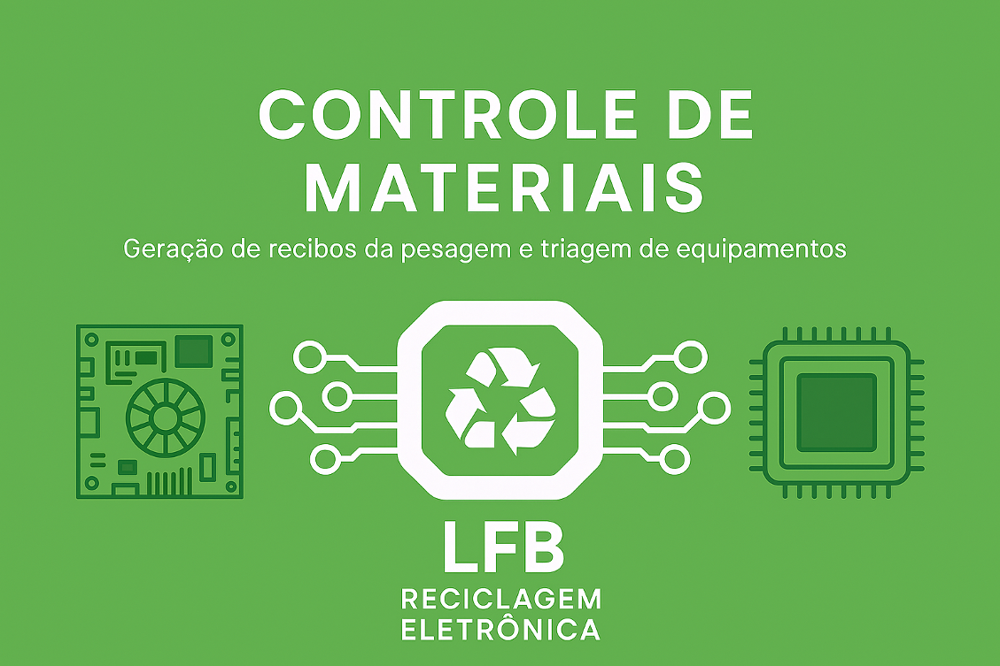

# Tutorial — LFB Sistema de Recibos

**Guia completo de uso do sistema com imagens passo a passo.**

</div>

---

## Índice

- [Abrindo o app](#1-abrindo-o-app)
- [Tela principal](#2-tela-principal)
- [Seleção de linha](#3-seleção-de-linha)
- [Editando valores](#4-editando-valores)
- [Itens Personalizados](#5-itens-personalizados)
- [Campo Impurezas](#6-campo-impurezas)
- [Registrando pesos e calculando totais](#7-registrando-pesos-e-calculando-totais)
- [Exportando o recibo PDF](#8-exportando-o-recibo-pdf)
- [Exemplo de recibo gerado](#9-exemplo-de-recibo-gerado)
- [Abrindo a tela de tabelas de preços](#10-abrindo-a-tela-de-tabelas-de-preços)
- [Selecionando uma tabela](#11-selecionando-uma-tabela)
- [Ativando uma tabela](#12-ativando-uma-tabela)
- [Exportando a lista de preços em PDF](#13-exportando-a-lista-de-preços-em-pdf)
- [Exemplo de lista de preços gerada](#14-exemplo-de-lista-de-preços-gerada)
- [Atalhos de teclado](#atalhos-de-teclado)
- [Localização dos arquivos gerados](#localização-dos-arquivos-gerados)

---

## 1. Abrindo o app

<div align="center">

</div>

Ao iniciar o **LFB Sistema de Recibos**, o programa:

- Carrega automaticamente a **tabela de preços ativa** do mês atual (se existir)
- Aplica os preços por kg na lista de materiais
- Deixa todos os campos de peso zerados, prontos para nova pesagem

> Se nenhuma tabela estiver ativa, os preços aparecerão como R$ 0,00. Ative uma tabela antes de registrar pesagens.

---

## 2. Tela principal

<div align="center">
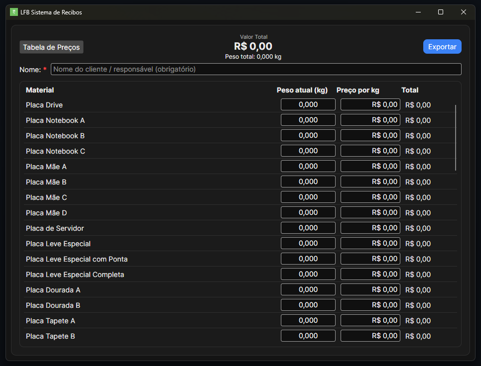
</div>

A tela principal é composta por:

| Elemento | Descrição |
|---|---|
| **Campo Nome** | Nome do fornecedor / responsável (obrigatório para exportar o recibo) |
| **Valor Total** | Soma monetária de todos os itens com peso > 0, atualizada em tempo real |
| **Peso Total** | Soma de todos os pesos (incluindo itens personalizados e impurezas), em kg |
| **Botão "Tabela de Preços"** | Abre a tela de gerenciamento de tabelas |
| **Botão "Exportar"** | Gera o recibo em PDF |
| **Lista de 52 materiais** | Campos de Peso (kg), Preço/kg e Total por item |
| **Itens Personalizados** | 4 linhas livres abaixo da lista principal |
| **Campo Impurezas** | Peso de impurezas (sem valor monetário) |

---

## 3. Seleção de linha

Clique em **qualquer parte de uma linha** (no nome do material, na área vazia, ou no campo de peso) para **selecioná-la**. A linha selecionada recebe um destaque azul semitransparente.

- Apenas uma linha pode estar selecionada por vez
- A seleção funciona tanto na lista principal quanto nos itens personalizados e na tabela de preços
- Ao entrar em edição (clicar num campo de texto), a linha também é selecionada automaticamente

---

## 4. Editando valores

### Confirmar edição
- Digite o valor e pressione **Enter**, ou clique em qualquer lugar fora do campo

### Cancelar edição
- Pressione **Esc** — o campo volta ao valor anterior e o foco é removido do campo

> O **Esc** funciona em todos os campos editáveis: peso, preço/kg dos materiais, itens personalizados, impurezas e preços na tabela de preços.

---

## 5. Itens Personalizados

<div align="center">
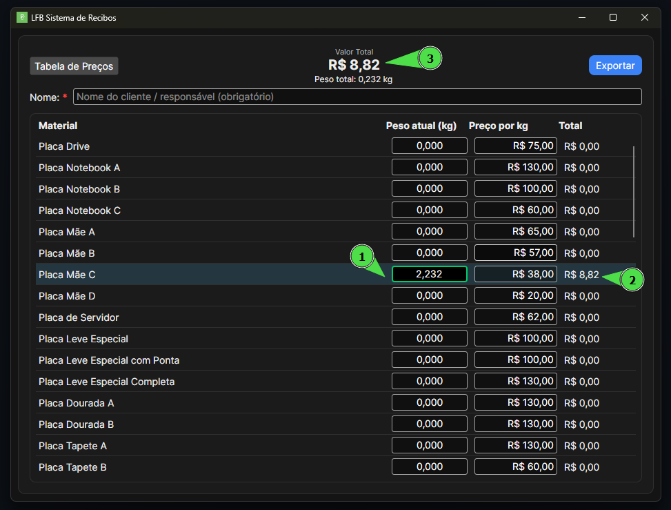
</div>

Abaixo da lista principal de 52 materiais, há uma seção **"Itens Personalizados"** com 4 linhas livres:

| Coluna | Descrição |
|---|---|
| **Nome** | Campo de texto livre — escreva o nome do material |
| **Peso atual (kg)** | Peso recebido em kg |
| **Preço por kg** | Preço unitário por kg |
| **Total** | Calculado automaticamente (peso × preço/kg) |

**Comportamento no recibo PDF:**
- Itens com **nome preenchido e peso > 0** são incluídos na tabela do recibo
- Itens vazios ou com peso zero são omitidos

---

## 6. Campo Impurezas

Logo abaixo dos itens personalizados há a linha **Impurezas**:

- Apenas o campo de **peso** está habilitado (o preço é fixo como `—`)
- O peso de impurezas **soma ao Peso Total** exibido no cabeçalho
- **Não entra** no cálculo do valor monetário
- Quando peso > 0, aparece no **final do recibo PDF** com as colunas de valor em branco

---

## 7. Registrando pesos e calculando totais

<div align="center">

</div>

1. **Informe o nome do fornecedor** no campo "Nome" no topo da tela
2. **Clique no campo de Peso** da linha do material recebido
   - A linha fica selecionada (destaque azul) automaticamente
   - O campo é limpo para digitação
3. **Digite o peso** em kg (ex: `12,500` ou `12.500`)
4. **Confirme** com **Enter** ou clicando fora
   - O Total do item e o Valor Total geral são atualizados imediatamente
5. Repita para todos os materiais recebidos
6. Se quiser cancelar: pressione **Esc** — o valor anterior é restaurado

> **Formatos aceitos:** vírgula ou ponto como separador decimal (`1,5` ou `1.5`)

---

## 8. Exportando o recibo PDF

<div align="center">
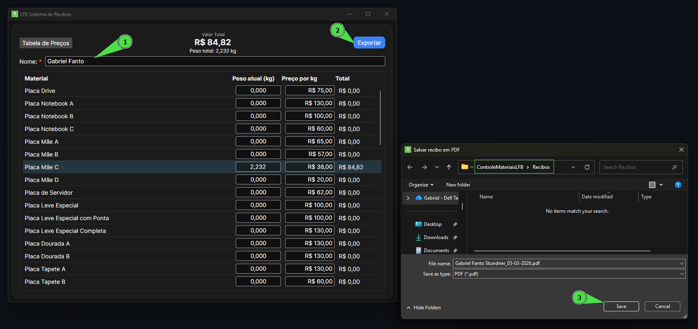
</div>

1. Certifique-se de que o **nome do fornecedor** está preenchido
2. Clique no botão **"Exportar"** no canto superior direito
3. Uma janela de salvamento será aberta, já direcionada para `Downloads/ControleMateriaisLFB/Recibos/`
4. Escolha o nome e local do arquivo e clique em **Salvar**

<div align="center">
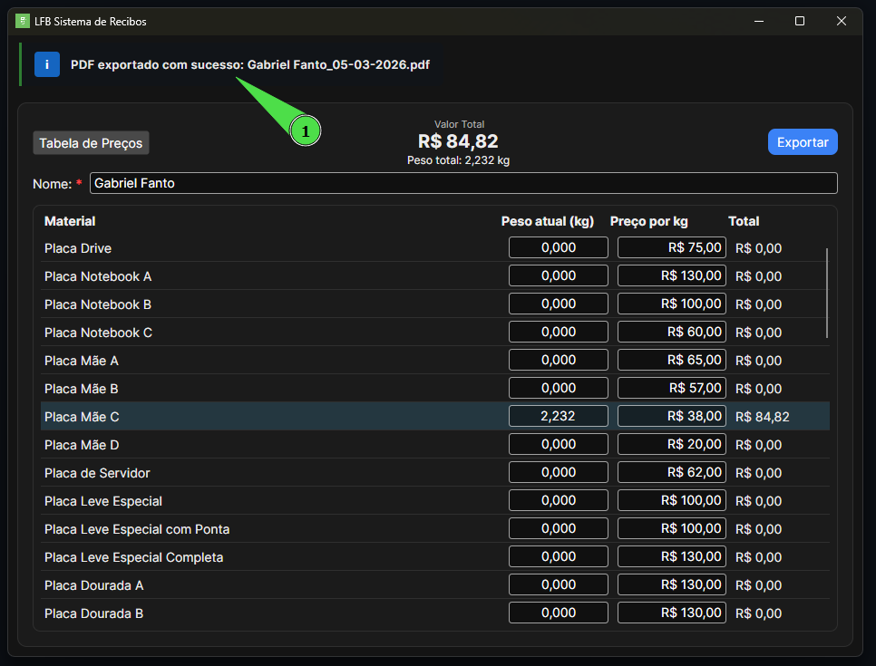
</div>

> Uma notificação verde confirma que o PDF foi gerado com sucesso.

---

## 9. Exemplo de recibo gerado

<div align="center">
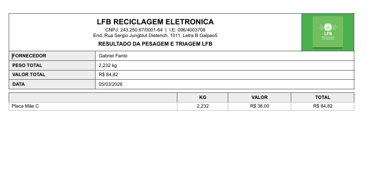
</div>

O recibo PDF contém:

- **Cabeçalho**: Logo LFB, nome da empresa, CNPJ, IE e endereço
- **Subtítulo**: "RESULTADO DA PESAGEM E TRIAGEM LFB"
- **Grade de informações**: Fornecedor, Peso Total, Valor Total e Data
- **Tabela de itens**: apenas materiais com peso > 0, com KG, Preço/kg e Total
- **Itens personalizados**: exibidos abaixo dos materiais do catálogo (se preenchidos)
- **Impurezas**: linha no final da tabela com peso, sem valor monetário (se peso > 0)

---

## 10. Abrindo a tela de tabelas de preços

<div align="center">
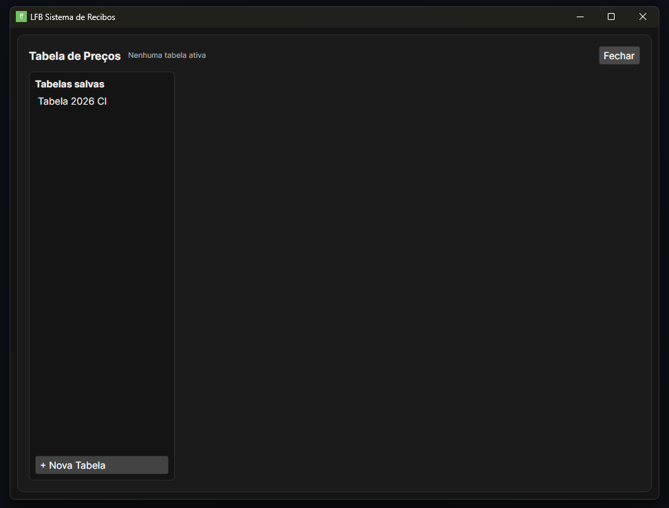
</div>

Clique em **"Tabela de Preços"** no canto superior esquerdo da tela principal.

A tela é dividida em:
- **Lista à esquerda**: tabelas salvas com indicação de qual está ativa
- **Editor à direita**: visível ao selecionar ou criar uma tabela
- **Botão "Fechar"** no canto superior direito: sempre visível, fecha a tela e volta à pesagem

---

## 11. Selecionando uma tabela

<div align="center">
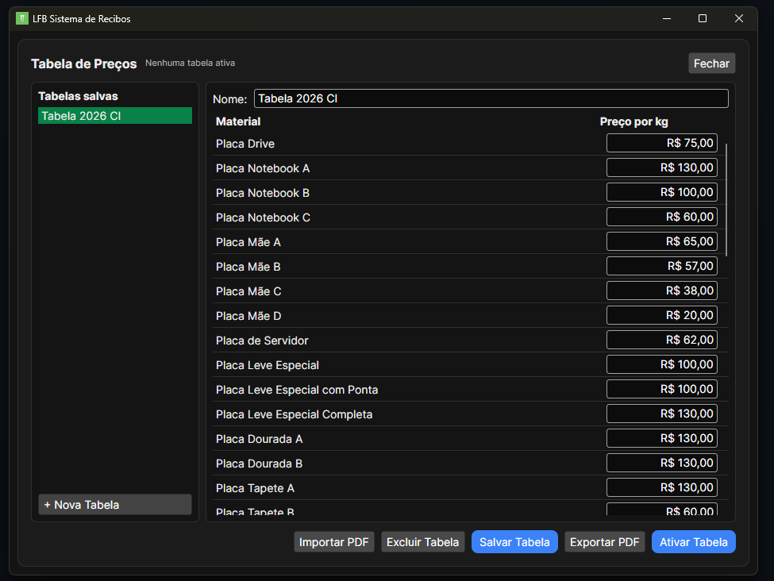
</div>

Clique sobre uma tabela na lista da esquerda para selecioná-la. O editor de preços aparece à direita com:

- **Campo Nome**: nome da tabela (editável)
- **Lista de materiais**: todos os 52 materiais com campo de preço por kg editável
- **Botões de ação**: Salvar, Ativar, Exportar PDF, Excluir, Importar PDF

> Os campos de preço funcionam igual à tela principal: clique para editar, **Enter** para confirmar, **Esc** para cancelar.

---

## 12. Ativando uma tabela

<div align="center">
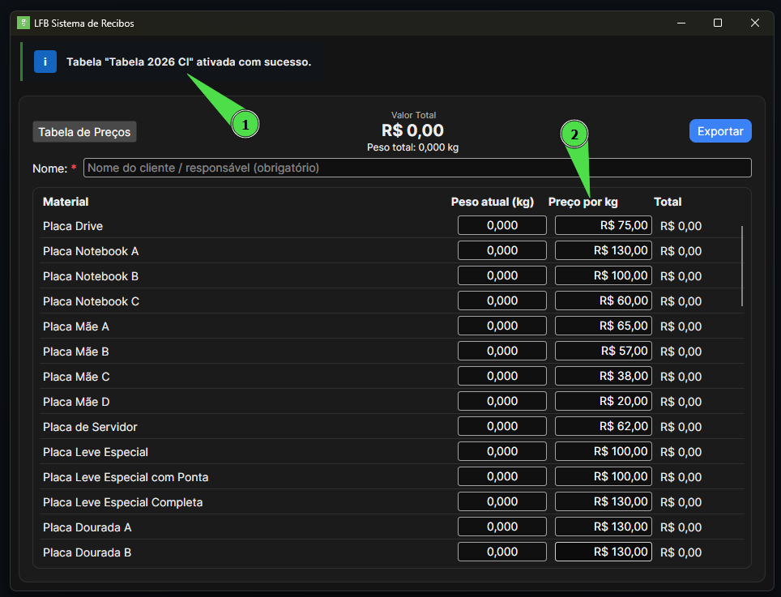
</div>

1. Selecione a tabela na lista
2. Clique em **"Ativar Tabela"**
3. A tabela recebe o selo **"ATIVA"** na lista
4. Os preços são aplicados imediatamente na tela principal
5. Uma notificação confirma a ativação

> A tabela ativa é carregada automaticamente na próxima vez que o programa for aberto.

---

## 13. Exportando a lista de preços em PDF

<div align="center">
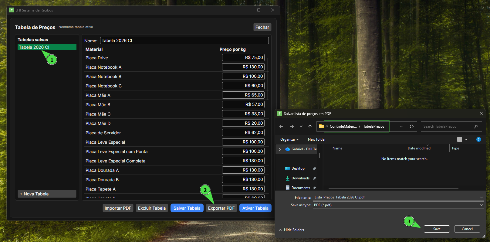
</div>

1. Selecione a tabela desejada
2. Clique em **"Exportar PDF"**
3. Escolha o local de salvamento

<div align="center">
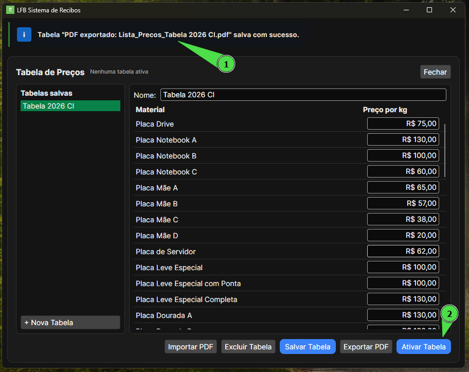
</div>

> Uma notificação confirma que o arquivo foi salvo.

---

## 14. Exemplo de lista de preços gerada

<div align="center">
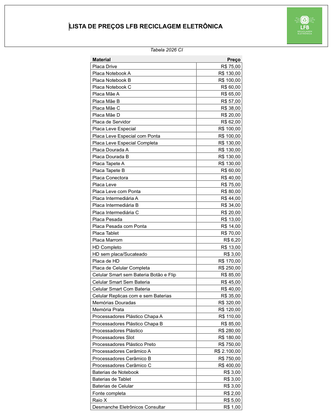
</div>

A lista de preços em PDF contém:

- **Cabeçalho**: título "LISTA DE PREÇOS LFB RECICLAGEM ELETRÔNICA" + logo LFB
- **Subtítulo**: nome da tabela (em itálico, centralizado)
- **Tabela centralizada** com colunas fixas:
  - Material (nome do item)
  - Preço (valor formatado em R$, alinhado à direita)
- Todos os 52 materiais do catálogo são listados

---

## Atalhos de teclado

| Tecla | Ação |
|---|---|
| **Enter** | Confirma o valor digitado e sai do campo |
| **Esc** | Cancela a edição, restaura o valor anterior e remove o foco |

---

## Localização dos arquivos gerados

Todos os arquivos são salvos automaticamente na pasta do usuário:

```
~/Downloads/ControleMateriaisLFB/
├── Recibos/               ← Recibos PDF gerados pelo botão "Exportar"
└── TabelaPrecos/
    ├── *.json             ← Tabelas de preços salvas
    └── *.pdf              ← Listas de preços exportadas
```

> `~` representa a pasta do usuário (ex: `C:\Users\SeuNome\` no Windows ou `/home/seunome/` no Linux)

---

<div align="center">

Desenvolvido para **LFB Reciclagem Eletrônica**  
CNPJ: 24.325.067/0001-64 · Rua Sergio Jungblut Dieterich, 1011 - Letra B, Galpão 5

</div>
